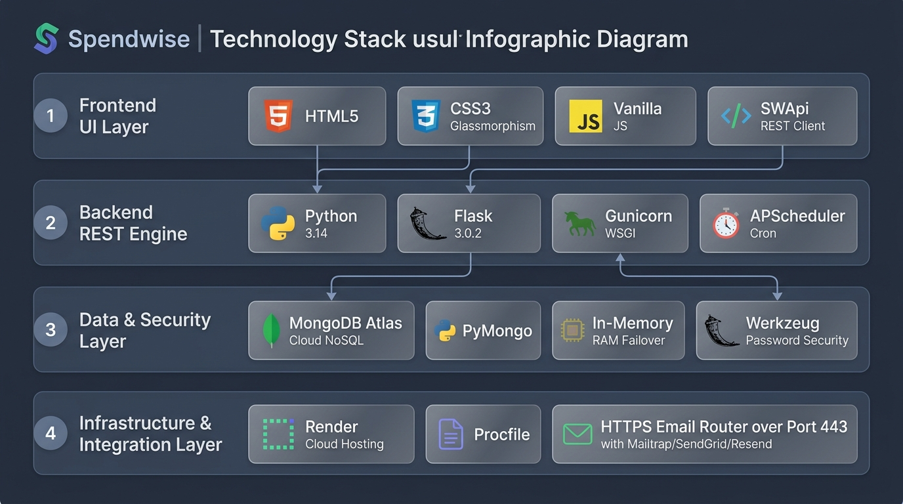
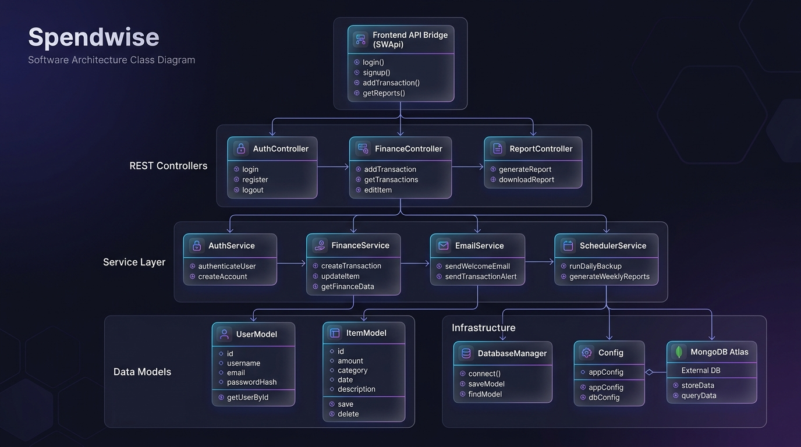
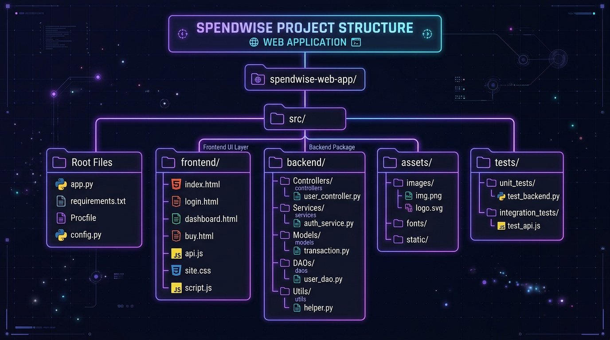
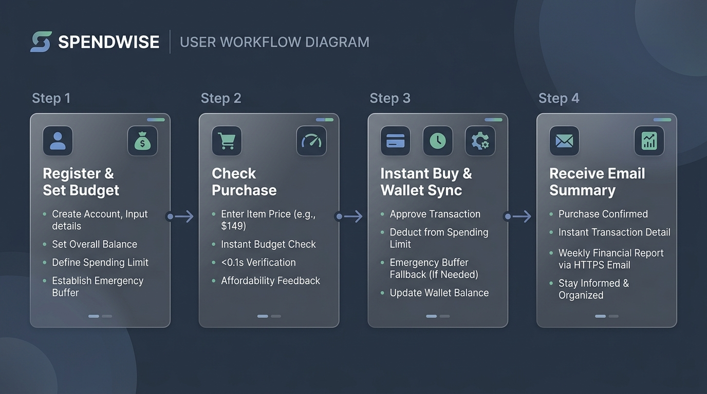
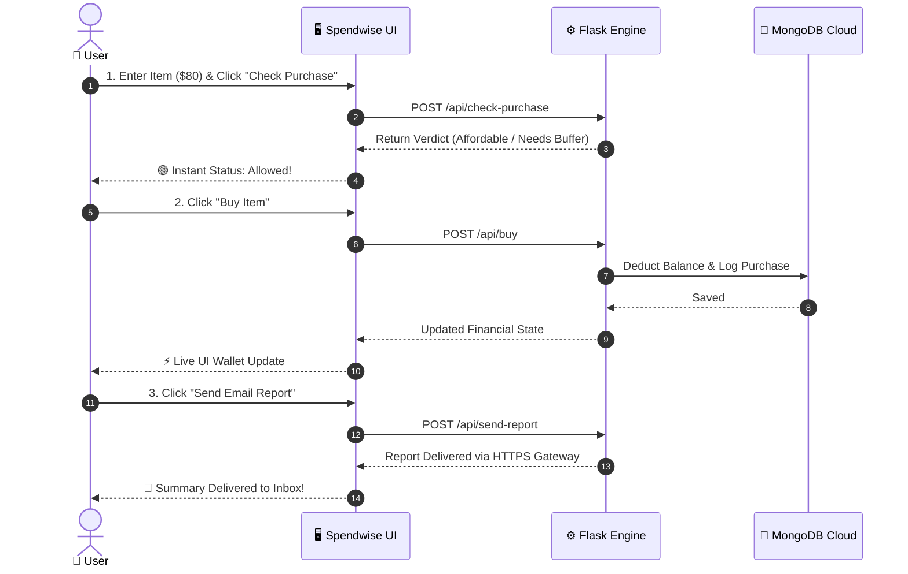
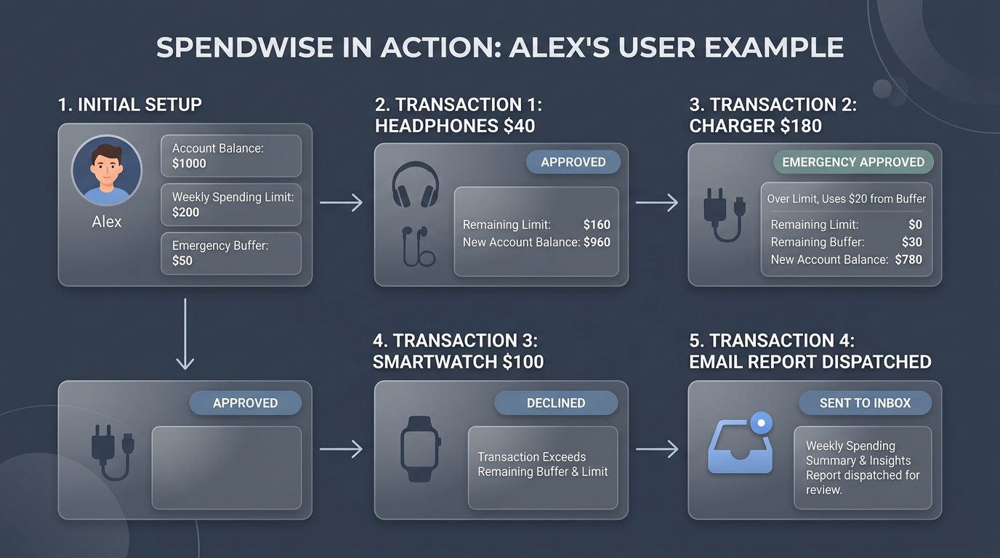
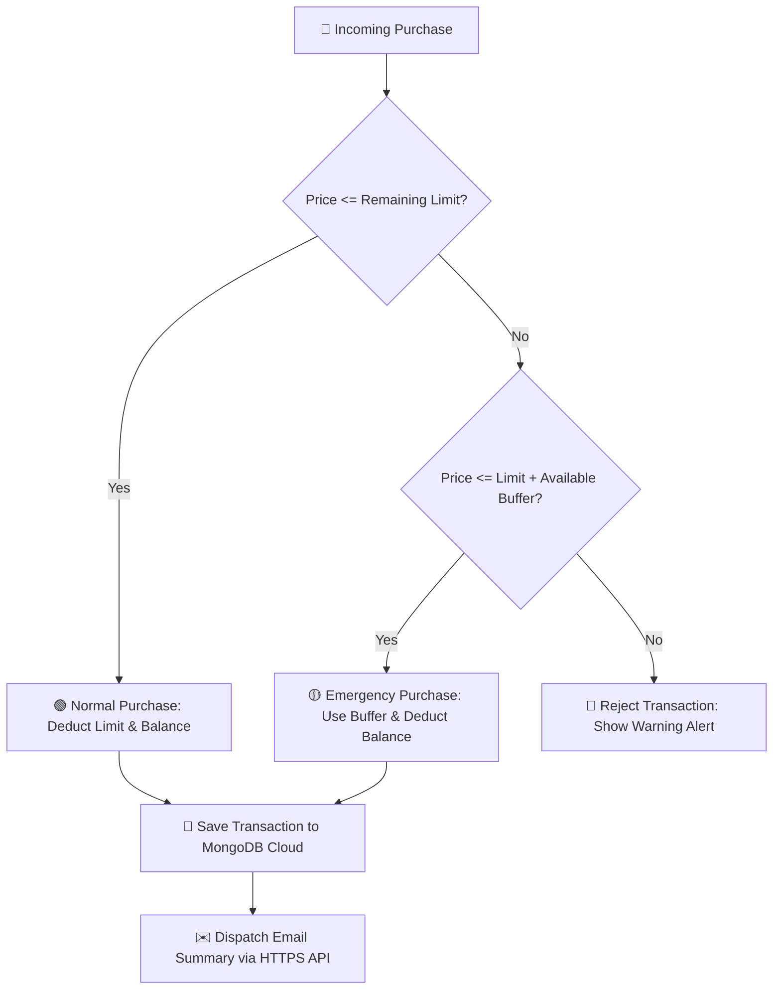
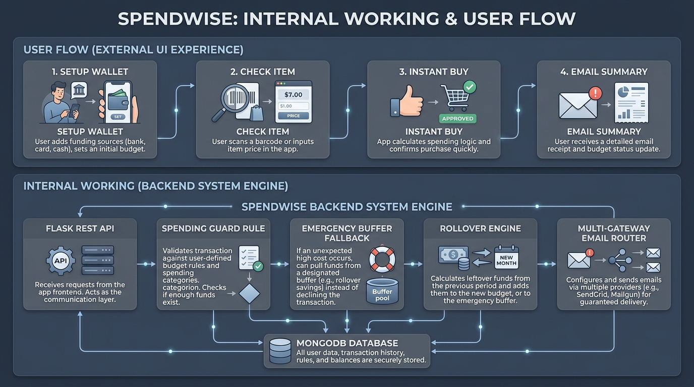

<div align="center">

# 💰 Spendwise – Smart Budget & Spending Guard

*A modern, intelligent personal finance guard & automated budget management platform.*

[](https://python.org)
[](https://flask.palletsprojects.com/)
[](https://mongodb.com)
[](https://render.com)
[](LICENSE)

</div>

---

## 🛠️ Technology Stack

<p align="center">
  
</p>

---

## 🏛️ System Architecture

<p align="center">
  
</p>

---

## 📁 Project Folder Structure

<p align="center">
  
</p>

```text
Spendwise/
├── 📄 app.py                     # WSGI entrypoint for cloud deployment (Render, Heroku)
├── 📄 Procfile                   # Production Gunicorn process launcher
├── 📄 requirements.txt           # Python dependencies (Flask, PyMongo, Gunicorn, APScheduler)
├── 📄 .env.example               # Environment variables template
├── 📄 .gitignore                 # Excluded files (venv/, .env, __pycache__)
├── 📄 README.md                  # System architecture & user flow documentation
│
├── 🌐 Frontend UI Layer
│   ├── 📄 index.html             # Main dashboard & wallet overview
│   ├── 📄 login.html             # User login page
│   ├── 📄 signup.html            # Registration & budget setup page
│   ├── 📄 profile.html           # Profile settings & spending limit management
│   ├── 📄 buy.html               # Real-time purchase evaluation & buy interface
│   ├── 📄 api.js                 # Data bridge client (window.SWApi REST fetcher)
│   ├── 📄 common.js              # Shared UI helpers, toast notifications, theme utilities
│   └── 📄 site.css               # Vanilla CSS design system & glassmorphism styling
│
├── 📁 assets/                    # Media assets & visual diagrams
│   ├── 🖼️ tech_stack_diagram.jpg   # Visual technology stack infographic diagram
│   ├── 🖼️ architecture_diagram.jpg # Visual software architecture diagram
│   ├── 🖼️ folder_structure_diagram.jpg # Visual project folder structure diagram
│   ├── 🖼️ user_flow_diagram.jpg   # Visual user working flow diagram
│   ├── 🖼️ internal_vs_external_flow.jpg # Visual dual flow diagram
│   └── 🖼️ user_example_diagram.jpg # Visual user walkthrough example diagram
│
├── ⚙️ backend/                    # Core Python Flask Backend Package
│   ├── 📄 app.py                 # Application Factory, route handlers, static file serving
│   ├── 📄 config.py              # Environment configuration loader (Config class)
│   ├── 📄 database.py            # MongoDB Atlas connection manager & in-memory failover
│   │
│   ├── 📁 controllers/           # REST API Blueprints
│   │   ├── 📄 auth_controller.py    # Login, signup, session & profile routes (/api/auth)
│   │   ├── 📄 finance_controller.py # Check-purchase, buy & items routes (/api/finance)
│   │   └── 📄 report_controller.py  # Email report dispatch routes (/api/send-report)
│   │
│   ├── 📁 models/                # Data Access Objects (MongoDB DAOs)
│   │   ├── 📄 user_model.py         # MongoDB 'users' collection schema & DAO
│   │   └── 📄 item_model.py         # MongoDB 'items' collection schema & DAO
│   │
│   ├── 📁 services/              # Domain Business Services
│   │   ├── 📄 auth_service.py       # BCrypt password hashing & session authentication
│   │   ├── 📄 finance_service.py    # Spending limit checks, emergency buffer & rollovers
│   │   ├── 📄 email_service.py      # Resilient HTTPS email generator & multi-gateway router
│   │   └── 📄 scheduler_service.py  # APScheduler background cron jobs for periodic renewals
│   │
│   └── 📁 utils/                 # Utility Helpers
│       ├── 📄 helpers.py            # ISO date parser, currency rounder, elapsed time math
│       └── 📄 validators.py         # Input payload validation & standardized error responses
│
└── 📁 tests/                     # Automated Test Suite
    └── 📄 test_backend.py        # Python unittest suite for auth, limits, buffer & emails
```

<details open>
<summary><b>🔍 Directory Component Breakdown (Click to Expand / Collapse)</b></summary>
<br>

| Folder / File | Responsibility & Purpose |
| :--- | :--- |
| **`backend/controllers/`** | Defines Flask API endpoints (`auth_bp`, `finance_bp`, `report_bp`). Parses incoming REST HTTP requests and returns JSON responses. |
| **`backend/services/`** | Contains the core business logic (BCrypt password hashing, financial guard rules, emergency buffer checks, email routing). |
| **`backend/models/`** | Data Access Layer (DAOs) interfacing directly with PyMongo collection queries (`users` and `items`). |
| **`backend/database.py`** | Database singleton managing Cloud MongoDB Atlas connections with automatic fallback to an in-memory RAM store. |
| **`api.js`** | Frontend API bridge (`SWApi`). Auto-detects production relative `/api` paths vs local `localhost:5001`. |
| **`Procfile` & `app.py`** | Web Server Gateway Interface (WSGI) launcher configured for Gunicorn cloud deployments on Render. |

</details>

---

## 🔄 User Journey & Data Flow

<p align="center">
  
</p>



---

## 🌐 1. External Working Flow (User Experience)

> [!NOTE]
> The **External Flow** is what you see and experience live on your screen. Everything updates instantly in real-time.

<details open>
<summary><b>▶️ Step-by-Step Experience Guide (Click to Expand / Collapse)</b></summary>
<br>

### 🔑 Step 1: Sign Up & Set Your Wallet
* Register your account and configure your core budget:
  * 💵 **Main Balance**: Your total wallet balance (e.g. `$1,200.00`).
  * 🎯 **Spending Limit**: Your max budget allowance per period (e.g. `$200.00` per week).
  * 🛡️ **Emergency Buffer**: Backup safety fund for extra expenses (e.g. `$50.00`).

### 🔍 Step 2: Check Before You Spend
* Type an item name and cost (e.g. *"Running Shoes - $80"*).
* Click **Check Purchase** to test whether you can afford it.
* Spendwise evaluates your limit, balance, and emergency reserve in **0.1 seconds**.

### 🛍️ Step 3: Buy & Live Wallet Update
* Click **Buy Item**. Spendwise immediately deducts the cost from your remaining limit and wallet balance on screen.
* If the cost exceeds your remaining limit, Spendwise automatically uses your **Emergency Buffer** to cover the gap safely!

### 📩 Step 4: Get Your Financial Report
* Click **Send Email Report** to receive an instant summary detailing your remaining budget, balance, and purchase history.

</details>

---

## 💡 Real-Life Walkthrough Example (Meet Alex)

<p align="center">
  
</p>

> [!TIP]
> **Concrete Walkthrough Scenario**:
> 
> * **Alex's Initial Setup**: Wallet Balance: `$1,000.00` | Weekly Limit: `$200.00` | Emergency Buffer: `$50.00`.
> 1. **Regular Purchase ($40 Headphones)**:
>    * *UI*: Alex clicks **Check Purchase**. Screen shows 🟢 *Allowed!*
>    * *System*: `$40 ≤ $200` limit. New limit becomes `$160`, balance becomes `$960`. Saved to MongoDB.
> 2. **Emergency Buffer Purchase ($180 Laptop Charger)**:
>    * *UI*: Charger costs `$180`, limit remaining is `$160`. Screen shows 🟡 *Emergency Purchase Available (Uses $20 Buffer)*.
>    * *System*: `$180 ≤ $160 (Limit) + $50 (Buffer)`. Consumes `$20` buffer. Limit drops to `$0.00`, buffer drops to `$30.00`, balance drops to `$780.00`.
> 3. **Over-Budget Block ($100 Smartwatch)**:
>    * *UI*: Screen shows 🔴 *Declined! Exceeds limit ($0) and buffer ($30)*. Button disabled.
>    * *System*: Flask returns `400 Bad Request`. Balance stays safe at `$780.00`.
> 4. **Email Report**:
>    * *UI*: Alex clicks **Send Email Report**.
>    * *System*: Flask compiles HTML report & dispatches via HTTPS Mailtrap API to Alex's inbox.

---

## ⚙️ 2. Internal Working Flow (System Mechanics)



> [!TIP]
> The **Internal Flow** is the automatic rules engine running inside Flask and MongoDB Atlas behind the scenes.

<details open>
<summary><b>▶️ Automatic Rules Engine (Click to Expand / Collapse)</b></summary>
<br>

### 🟢 Rule 1: The Spending Guard
* When a purchase is made, Spendwise verifies if `Item Cost ≤ Remaining Limit`.
* If true, it deducts the cost directly from both your remaining period limit and main balance.

### 🟡 Rule 2: Emergency Buffer Protection
* If an item costs more than your remaining limit, Spendwise checks if your **Emergency Buffer** can cover the difference.
* If `Item Cost ≤ Remaining Limit + Available Buffer` and `Item Cost ≤ Balance`, the transaction is approved as an **Emergency Purchase**, consuming the buffer reserve.

> [!IMPORTANT]
> **Emergency Buffer Safety**: Once the emergency buffer is used, remaining limit drops to `$0.00` to protect you from further overspending until the next period.

### 🔄 Rule 3: Leftover Rollover Engine
* Whenever a new period starts (daily, weekly, or monthly), Spendwise detects that time has elapsed.
* **Rollover Balance**: Unused budget from the previous period is automatically added to your new period limit (`New Limit = Base Limit + Leftover`).

### ✉️ Rule 4: Multi-Gateway Smart Email Router
* To ensure emails are delivered without cloud network blocks, Spendwise routes outgoing emails through a **Resilient HTTPS Gateway Cascade**:
  $$\text{Mailtrap} \longrightarrow \text{Mailjet} \longrightarrow \text{SendGrid} \longrightarrow \text{Brevo} \longrightarrow \text{Resend} \longrightarrow \text{SMTP}$$
* Uses standard HTTPS port `443` (never blocked by cloud servers like Render).

</details>


---

## 📊 Summary Matrix: External vs Internal

<p align="center">
  
</p>

| Aspect | 🌐 External Flow (User Experience) | ⚙️ Internal Flow (System Engine) |
| :--- | :--- | :--- |
| **Primary Focus** | Interactive dashboard, real-time feedback, visual status | Data validation, financial security rules, NoSQL storage |
| **Triggers** | Button clicks, inputs, page loads, report requests | REST controllers, background scheduler timers, DB queries |
| **Technology** | HTML5, CSS3, Vanilla JS (`SWApi` data bridge) | Python 3.14, Flask REST API, PyMongo, BCrypt |
| **Security** | Session persistency, localStorage checks | Server-side payload validation, sanitized JSON output |
| **Reliability** | Toast alert notifications, smooth UI state | Hybrid DB failover, multi-gateway HTTPS email cascade |

---

## 🛡️ Reliability & High Availability Features

> [!IMPORTANT]
> **Zero-Downtime Database Failover**: If MongoDB Atlas is starting up or temporarily unreachable, Spendwise seamlessly activates an **In-Memory RAM Store** so your app stays 100% responsive for user testing.

> [!TIP]
> **Zero-Crash Email Fallback**: If all external email APIs are unavailable, Spendwise gracefully compiles your financial report preview without throwing 500 server errors.

Application Demo :


https://github.com/user-attachments/assets/77f84ec9-0fdb-4755-8a91-9ad43f9de0d9


